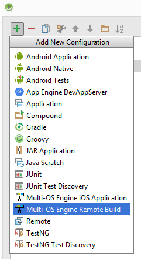
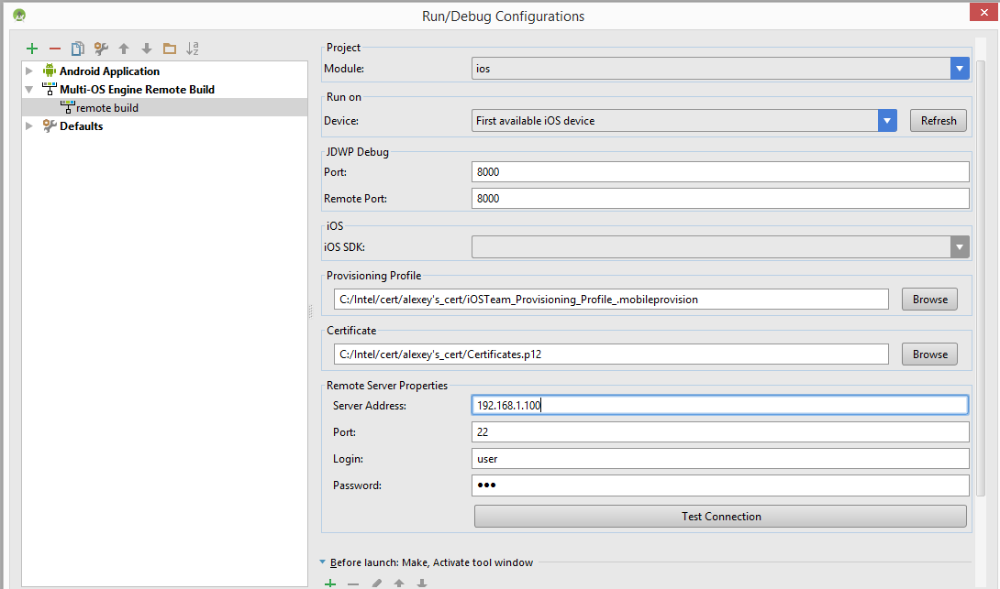
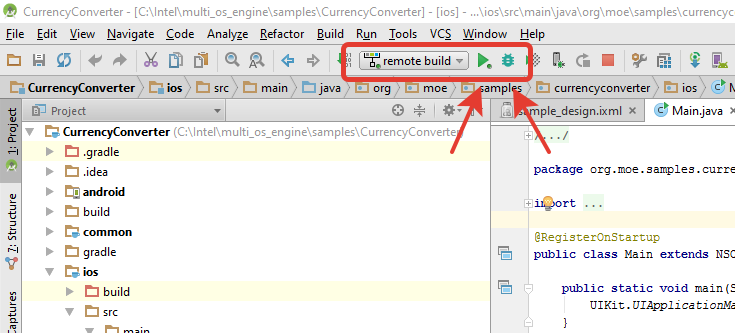

===========================
Remote Build
===========================

Remote build provides the following capabilities:

- Building .app and .ipa files for iOS* devices on remote macOS system in located in a local network from Android Studio* on Windows*.
- Run and debug iOS* apps built remotely on iOS* devices connected to Windows* host

Running iOS* apps on a simulator on Windows* hosts is not possible.

This tutorial covers information related to the Remote build to get started: 

- How to create remote build configuration and run the build
- Apple* P12 certificate and provisioning profile obtaining
- Known issues and troubleshooting steps

Requirements for Windows* hosts:

- Microsoft* Windows* 7 x64 edition or later
- Google* Android Studio* 1.5 or later
- Java* Development Kit (JDK) version 8
- Android* Platform SDK
- Apple* iTunes*

Creating build configuration in Android Studio
-----------------------------------------------

Go to "Run" => "Edit Configuration" to create remote build configuration.

.. image:: images/edit_build_configuration.png

Click "+" and choose "Multi-OS Engine Remote build"

Load your provisioning profile and Apple* P12 certificate to the build configuration, enter address of remote macOS machine, enter user name and password:

Please make sure that Info.plist in <project_root>/ios/Xcode/<project_name> contains a valid Bundle ID corresponding to the provisioning profile. For more information, please visit: `About Bundle IDs`_

.. _About Bundle IDs: https://developer.apple.com/library/ios/documentation/IDEs/Conceptual/AppDistributionGuide/ConfiguringYourApp/ConfiguringYourApp.html#//apple_ref/doc/uid/TP40012582-CH28-SW8

Apple developer certificate is needed in order to run the code on a physical iPhone and iPad. Apple Mac machine and membership in Apple Developer Program ($99/year) are needed to generate P12 certificate and to submit your apps to the AppStore. It is possible to generate the certificate using "free" Apple developer account on macOS with Xcode 7, but you will not be able to submit your application to AppStore using this certificate. 

Run and Debug iOS* app
-----------------------

Click "run" or "debug" icon to run or debug sample on device respectively

To see the build progress, open "Multi-OS Engine" tab:

.. image:: images/build_progress.png

All build logs will be placed in the “<project_root>/ios/build/logs” folder.

How to build IPA for application deploying
-------------------------------------------

To build IPA file go to the "Build" tab and choose "Export IPA for Application" option, choose remote build configuration in the popped up window and click "OK" to start build

.. image:: images/export_ipa.png

After successful build, you can double click on the .IPA to open by in Apple iTunes*. Click "Install" and then "Sync" to install it to iOS device connected to the Windows machine:

.. image:: images/itunes.png

Getting Apple developer certificate and provisioning profile on macOS
-------------------------------------------------------------------------

Go to macOS machine, open Xcode, open the Accounts preferences pane, and check whether your Apple ID is registered. If it's not listed, click "+" button to add it.

.. image:: images/xcode.png

Make sure that you have a valid signing identity and provisioning profiles. Choose your account in the accounts preferences pane and click on "View Details".

.. image:: images/xcode2.png

To export P12 certificate, start the Apple Keychain Access* application by opening the Applications folder and choosing the Utilities option. 

.. image:: images/export1.png

Select the Apple certificate to be exported, click File in your Apple menu and select Export Items from the drop-down menu.

.. image:: images/export2.png

In the Save As field, enter a name for the Export p12 file. Enter a password for your p12 file (1 character minimum). Click OK.

.. image:: images/export3.png

Copy the downloaded p12 file to your Windows* system so you can use it to configure MOE remote build.

To find existing provisioning profile on your hard drive, go to Xcode -> Preferences -> Accounts -> View Details, right click on the provisioning profile with required Bundle ID and select "Show in Finder:

.. image:: images/profiles.png

You can generate new Provisioning Profile on Apple* web site. Go to https://developer.apple.com, sign in to Member Center, and open "Certificates, Identifiers & Profiles" link:

.. _https://developer.apple.com: https://developer.apple.com

After you sign into your Apple* Developer account using a web browser, select Certificates, Identifiers & Profiles. Click Provisioning Profiles, then select "Distribution", click "+" button.
Select your distribution type ("Ad Hoc" for testing or "App Store" for a final distribution/production build), click continue. Then select your App ID and click Continue. 
Then select your certificate, select the desired devices. Name, generate, and download the  Provisioning Profile.

You can create multiple Ad Hoc provisioning profiles depending on the testing devices to be used. Typically, create one or more for ad hoc testing purposes. Later, create a production provisioning profile for the final Apple AppStore distribution.

Certificates generation using "free" Apple developer account
-------------------------------------------------------------

Prerequisites:

- macOS machine with installed Xcode 7.x
- iOS device connected to the mac machine

Limitations of the free certificate:

- You will not be able to submit your applications to AppStore*
- You can't manage your certificates and provisioning profiles using `https://developer.apple.com`_ site

.. _https://developer.apple.com: https://developer.apple.com

Create a free Apple ID if you don't have it.

Open Xcode 7, navigate to Xcode -> Preferences -> Accounts and press "+" button to add your Apple ID. Select your account and press the "View Details" button.

The next screen allows you to create the development certificate. To do this, press the Create button next to the iOS development text. Once this process has completed, press Done.

.. image:: images/free_cert.png

Now you can find the generated development certificate in "Keychain Access" program.

.. image:: images/free_cert2.png

Now connect your iOS* device to the macOS machine. Create new project for iOS* using Xcode* project wizard (File -> New project). Enter the Product name, Organization Name and Organization Identifier sections, press Next and save your project. You should see the following screen:

.. image:: images/free_cert3.png

Select your iOS* device from the target selection drop-down menu. Press the "Fix Issue" button to create the provisioning profile for your device. Press the "Play" icon to build the project and deploy the application to device to ensure that everything is set up correctly.

It's possible that the first time you get message "process launch failed: security". It indicate that provisioning profile was not approved by device. To fix it you should go Settings -> General -> Profiles and mark corresponding profile trusted. To save the development certificate as .p12 file, go to Keychain Access, select the certificate, open the arrow to also select the private key and export them together as a .p12 file. To find the provisioning profile, go to Xcode* -> Preferences -> Accounts -> View Details. right click on the provisioning profile with required Bundle ID and select "Show in Finder".

.. toctree::
    :maxdepth: 2

