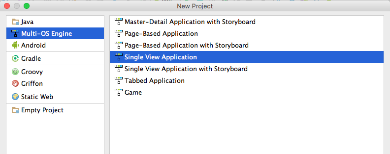
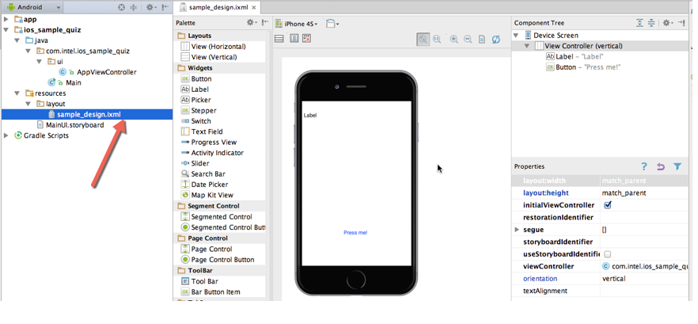
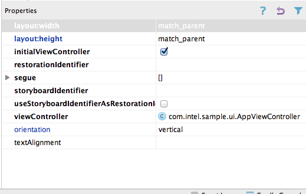
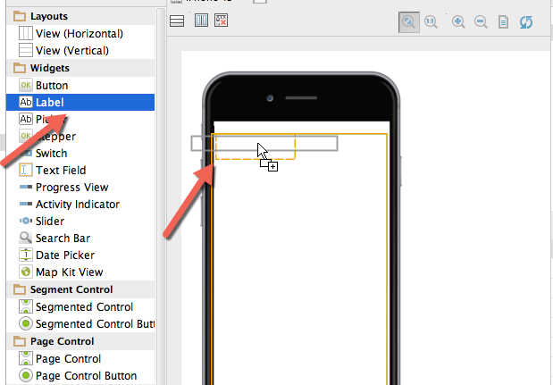
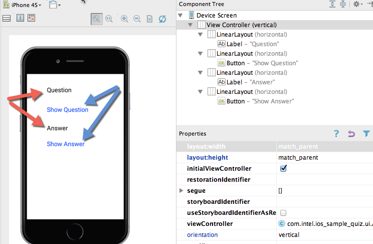
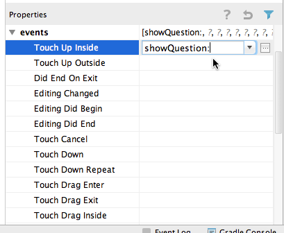
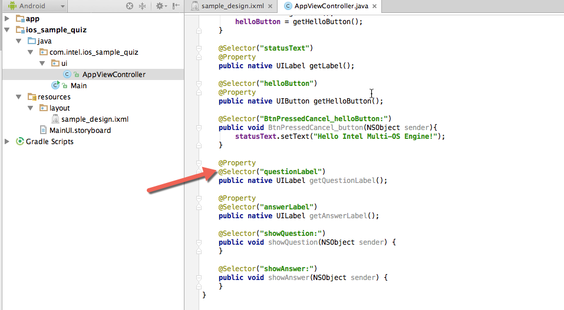
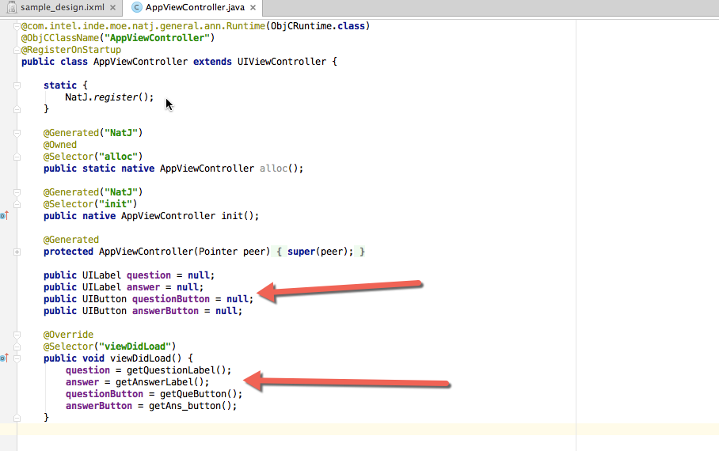
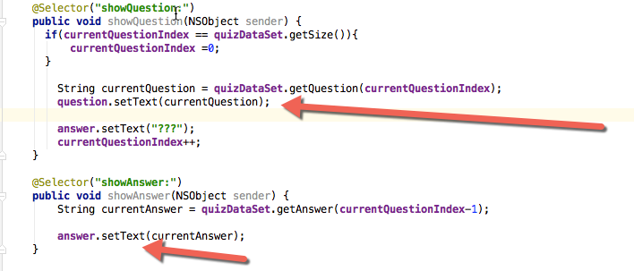
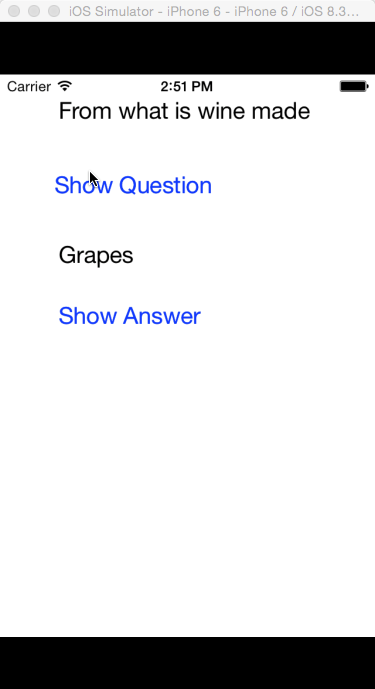

=============================================
Creating a UI with the Multi-OS Engine UI Designer
=============================================

The Multi-OS Engine provides a UI Designer plugin to build Apple iOS* applications. The builder is similar to Android* layout to build but has view objects similar to that of iOS. This tutorial shows you how to build a simple Quiz application for iOS using Multi-OS Engine UI builder.

Step 1: To build any Multi-OS Engine application, start with creating a stock Android sample application like this.

.. image:: images/design1.png

Step 2: Right click on the Android project and select Multi-OS Engine Project to create a new module.

.. image:: images/design2.png

Step 3: Select Single View Application as a starting point for making the app.

Step 4: Name your application and click Finish.

.. image:: images/design4.png

Step 5: These are the files that are created by the Multi-OS Engine.

.. image:: images/design5.png

Step 6: Click on the sample_design.ixmlfile to start editing your UI.

Step 7: Some parameters are already set by default, such as the initialViewController and its viewController. You can set parameters according to your own needs.

Step 8: After deleting the default label and button, you can start adding your own view objects. Drag and drop objects to add them to the layout.

Step 9: You can set all the parameters related to your UI in the properties tab. The parameters here are quite similar to those seen on Apple Xcode* software.

.. image:: images/design9.png

Step 10: Let's add two labels and two buttons to make the UI of the app.

Step 11: Name the iboutlets for all the view objects that you place in your UI.

.. image:: images/design11.png

Step 12: Set up your IBActions for buttons under events.

Step 13: The Multi-OS Engine automatically generates all the IBOutlets and IBActions in the corresponding Java* viewcontroller file.

Step 14: Now add the class variables corresponding to all the view objects in UI and assign them their corresponding IBOutlets in viewDidLoad method.

Step 15: Create a QuizDataSet.java file which can work as a data source for the app and instantiate its object in the AppViewController class.

.. image:: images/design15.png

Step 16: Set the text area of the Question and Answer Labels in the Action methods showQuestion and showAnswer.

Step 17: Run the app.

Now you have designed your first iOS app with the Multi-OS Engine UI designer.

.. toctree::
    :maxdepth: 1