=============================================
Creating a UI Using an Apple Xcode Storyboard
=============================================

For complex UI, you can use Xcode Interface Builder for designing the UI and Intel's Multi-OS Engine Technology Preview for generating the Java* bindings in Android Studio*. This topic demonstrates how to use this approach for building the same Quiz App as in the Creating a UI with the Multi-OS Engine UI Designer topic.

As Step 1, create a stock Android* application.

.. image:: images/story1.png

Step 2: Right click on the new Android project and select Multi-OS Engine Module to create a new iOS* module.

.. image:: images/story2.png

Step 3: Select Single View Application as a starting template for your app. This app is named QuizApp.

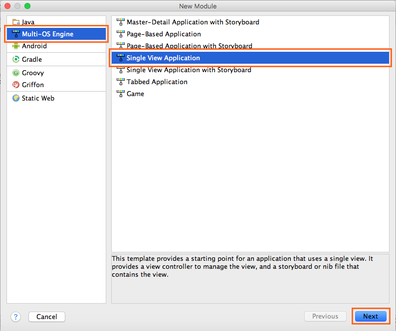

Step 4: Build the project to generate the Xcode project for your Multi-OS Engine module:  in Select Run/Debug Configuration choose QuizApp and press the Run button.

.. image:: images/story4.png

Step 5: In the project structure find and delete the files AppViewController, MainUI.storyboard and the folder resources/layout - you will regenerate them after designing the UI in the Xcode Interface Builder. It may prompt you that there are other references and if you still want to delete these files. Go ahead and delete them.

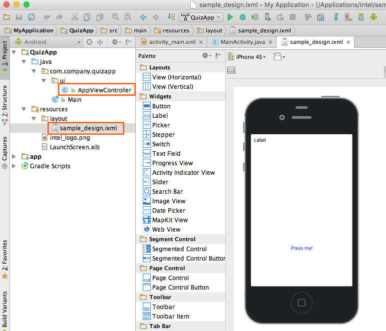

Step 6: Make sure the reference to AppViewController in the imports of Main.java has been removed.

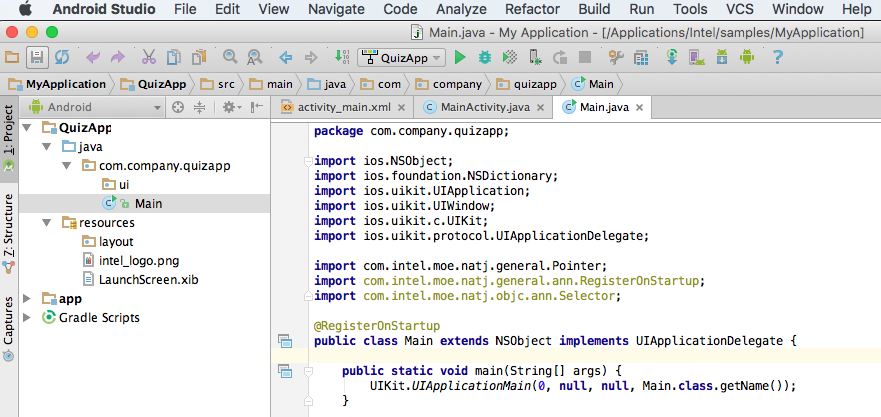

Step 7: Right click on QuizApp project and choose Open Project in Xcode from the Multi-OS Engine Actions menu.

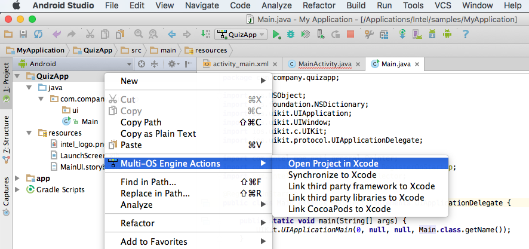

It will bring up the Xcode Editor.

.. image:: images/story71.png

Step 8: Expand the QuizApp project in Xcode and add a new source file based on Apple Cocoa Touch* class. Next screenshots illustrate how to create the MyViewController.m and MyViewController.h files.

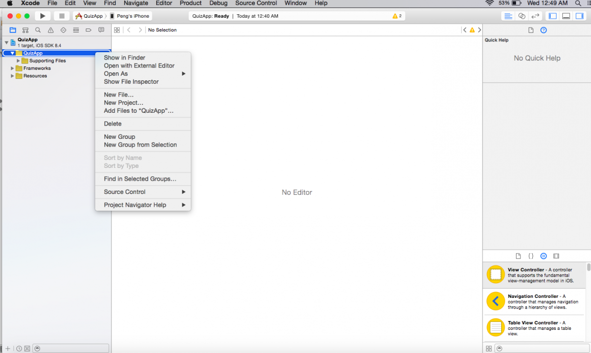

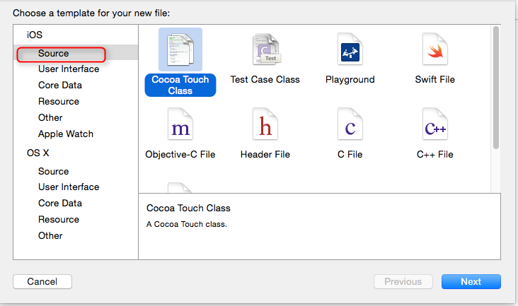

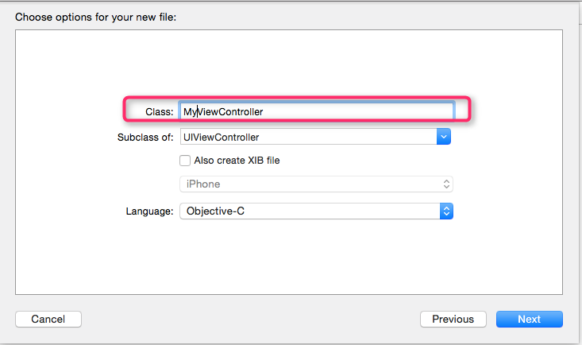

Step 9: Right click on the QuizApp project and create a new user interface. Name your Storyboard as MainUI because that is the name defined in the Multi-OS Engine templates in Android Studio which is going to be connected to this interface later. Save the created Storyboard in the <ios_module> /src/main/resources folder (the default folder is the <ios_module> /build/xcode).

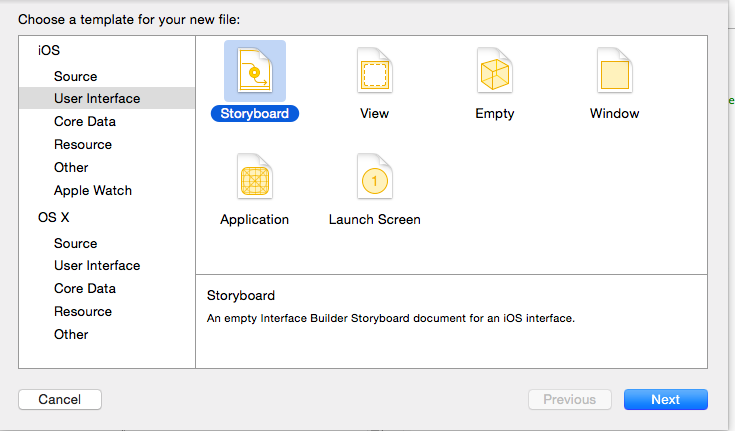

At the end of this step, you should see the new project structure like below.

Step 10: Drag a new ViewController and select the newly created MyViewController in the highlighted section.

.. image:: images/story10.png

Step 11: Pick the UI controls from the bottom right and drag them to the storyboard. For this app, you need two labels and two buttons.

Create an entry point in the Storyboard by checking Is Initial View Controller box on the right.

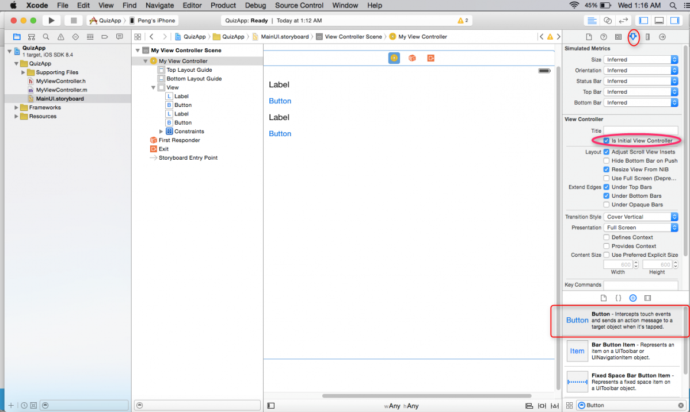

Step 12: Click on the circular icon as highlighted and open up MyViewController.h file from the center pane. Create the IBOutlets for the two labels and two buttons and IBActions for the two buttons by control-dragging from the objects in the Xcode Interface Builder to the header file in the assistant editor. Save the project.

.. image:: images/story12.png

Step 13:  Go back to Android Studio and right click on the QuizApp project, click Multi-OS Engine Actions and choose Synchronize to Java.

This will generate the MyViewController.java file. This file will contain the Java bindings for all of the UI controls and actions that you've created in Xcode. Whenever you add, delete or modify a UI element in Xcode, you need to generate UI Interface bindings by the process above.

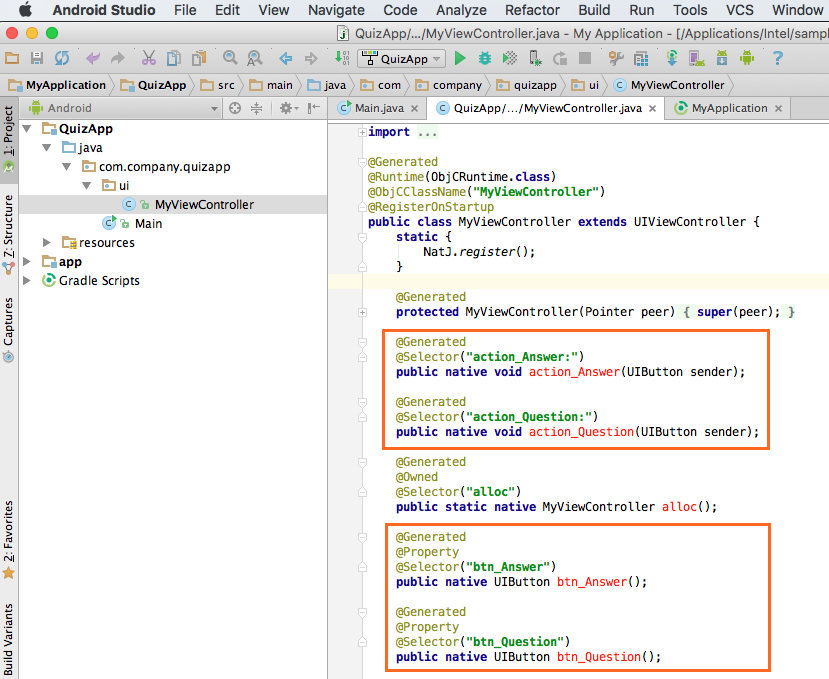

Step 14: Add a new Java class that implements a simple logic for the Quiz App.

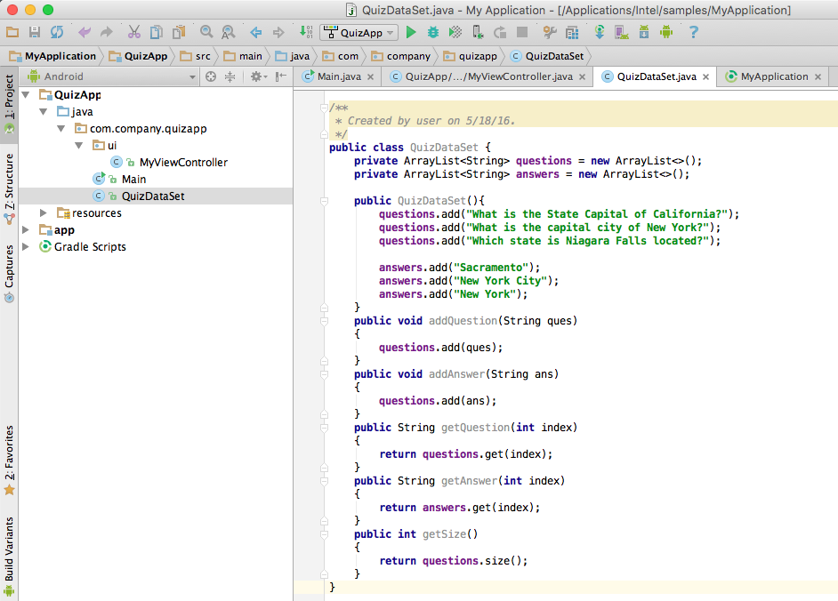

Step 15:  It is necessary to delete @Generated and native from the methods that you are going to modify. This is to imply that the originally generated code is overridden by the new Java function.

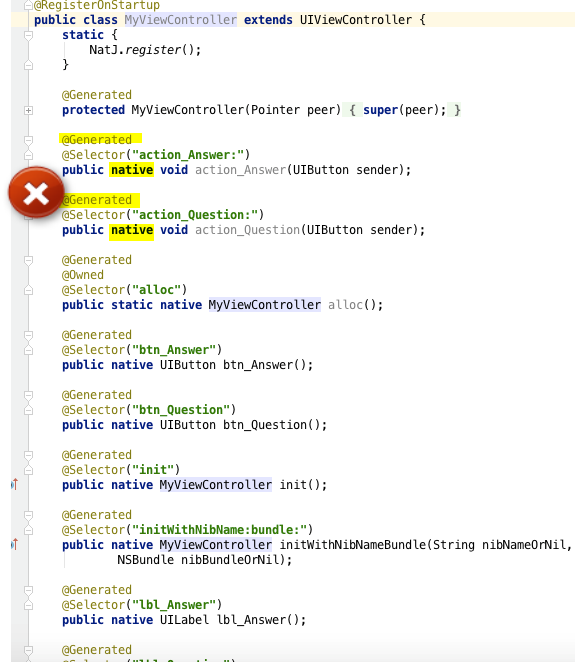

Step 16:  Create a new object of class QuizDataSet and initiate it in a separate method viewDidLoad(). Call the necessary methods from the above class in the action handlers defined for the two buttons. The screen below shows all that required to implement the logic.

.. image:: images/story16.png

Step 17: Run the project to see the app in action.

.. image:: images/story17.png

.. toctree::
    :maxdepth: 1